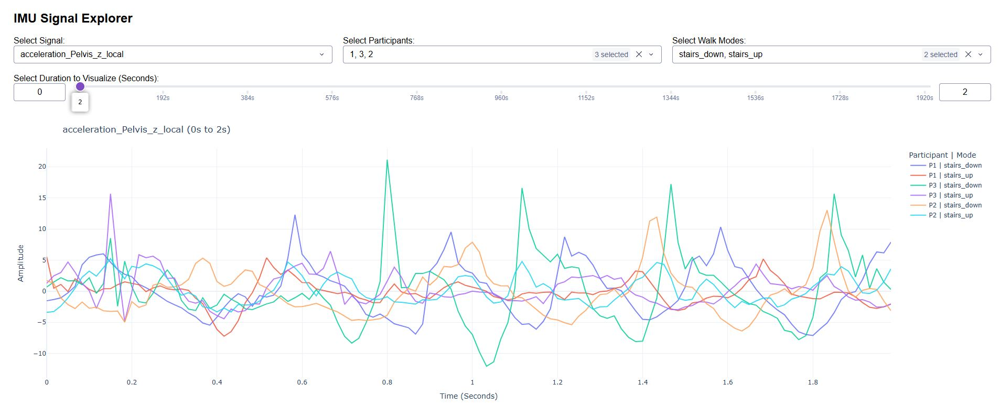

# IMU Signal Explorer Dashboard

An interactive local web application built with **Python** and **Dash** for visualizing, filtering, and exploring high-frequency **IMU (Inertial Measurement Unit)** time-series data across multiple participants and walking conditions.

---

## Dashboard Preview



---

## Features

- Interactive visualization of IMU signals
- Filter by one or more participants
- Filter by walking conditions
- Select individual sensor signals
- Explore specific time windows using a duration slider
- Built-in zoom, pan, hover, and reset tools powered by Plotly

---

## Prerequisites

Before running the application, make sure you have:

- Python **3.8** or newer
- `pip` (included with most Python installations)

### Required Dataset

Place the file `dataset.csv` in the same directory as `app.py`:

## Installation

1. Open a terminal (Command Prompt, PowerShell, or Terminal).

2. Navigate to the project directory:

```bash
cd path/to/folder
```

3. Install the required Python packages:

```bash
pip install dash pandas numpy plotly
```

---

## Running the Application

1. Ensure you are in the project folder containing both:

   - `app.py`
   - `dataset.csv`

2. Start the dashboard:

```bash
python app.py
```

3. When the server starts, you should see output similar to:

```text
Dash is running on http://127.0.0.1:8050/
```

4. Open your web browser and navigate to:

```text
http://127.0.0.1:8050/
```

---

## Using the Dashboard

### Select Signal

Choose a single IMU signal (for example, `acceleration_RightFoot_z_local`) to visualize. Only one signal is displayed at a time to prevent overlapping scales.

### Select Participants

Choose one or more participants from the dropdown menu. Remove participants by clicking the **×** next to their names.

### Select Walk Modes

Filter the data by walking condition, such as:

- Flat
- Stairs Up
- Stairs Down
- Slope Up
- Slope Down

### Duration Slider

Since IMU data contains thousands of samples, use the duration slider to display a smaller time window (for example, **0–10 seconds**) for smoother performance and easier analysis.

### Graph Controls

- **Zoom:** Click and drag to zoom into a region.
- **Pan:** Select the Pan tool (cross-arrows icon) and drag the graph.
- **Reset View:** Double-click anywhere on the graph.
- **Hover:** Move the cursor over a signal to view precise time and amplitude values.

---

## Troubleshooting

### FileNotFoundError

```
FileNotFoundError: No such file or directory: 'dataset.csv'
```

Ensure that:

- The dataset is named exactly:

```text
dataset.csv
```

- It is located in the same folder as `app.py`.

---

### Address Already in Use

```
Address already in use
```

Port **8050** is already being used.

Possible solutions:

- Close any previously running instance of the application.
- Restart your terminal.
- Run the application again.

---

### Empty Graph

If the dashboard loads but no data is displayed:

- Ensure at least **one Participant** is selected.
- Ensure at least **one Walk Mode** is selected.
- Verify that the selected signal exists in the dataset.

---